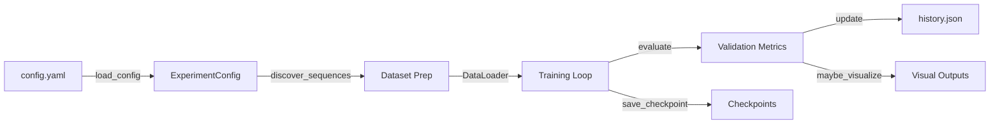
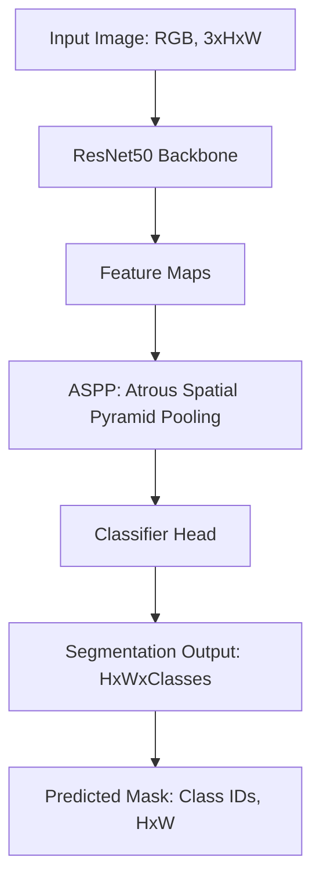

# ---
# Context Update (2025-12-07)

## System Status
- Python segmentation pipeline for DAVID-style datasets; meta-kernel operational.
- Dataset config now targets sibling repo `../3D-image-processing` with `Images/` & `Labels/` dirs.
- Training loop emits live progress (tqdm or inline), reports GPU memory.
- README covers setup, architecture, troubleshooting.
- Next: generate `requirements.txt`, implement `run_tests_py` tool (pytest wrapper).

## Tool Registry
- `project_structure`: JSON snapshot of directory tree.
- Planned: `run_tests_py` (pytest), more meta tools.

## Architecture
- Root: `train_david.py`, `config.yaml`, `meta_kernel.py`, `LICENSE`, `testing.ipynb`, `.gitignore`.
- Docs: `README.md` (quick start, config, dataset, roadmap).
- Package: `david_backend/` (config, data, engine, metrics, model, pipeline, visualization, __init__).
- Meta-layer: `.ai_meta/` (context map, tool scripts, kernel log).
- VCS: `.git/` tree.

# ---
# README Update (2025-12-07)

## Context Alignment
This repository is actively maintained with a meta-layer for context tracking and tool orchestration. The dataset configuration now expects a sibling repository (`../3D-image-processing`) with `Images/` and `Labels/` directories. Training emits live progress bars and GPU memory usage. Immediate next steps include publishing a `requirements.txt` and implementing a `run_tests_py` tool for automated testing.

## Tooling & Meta-Layer
- Meta-kernel (`meta_kernel.py`) manages project structure and tool execution.
- Planned tools: `run_tests_py` (pytest wrapper), linting, data validation.

## Architecture Recap
- Root files: `train_david.py`, `config.yaml`, `meta_kernel.py`, `LICENSE`, `testing.ipynb`, `.gitignore`.
- Backend: `david_backend/` (config, data, engine, metrics, model, pipeline, visualization, __init__).
- Documentation: `README.md` (setup, architecture, troubleshooting).
- Meta: `.ai_meta/` (context map, tool scripts, kernel log).

## Next Steps
- Generate `requirements.txt` for reproducible environments.
- Implement `run_tests_py` for test automation.
- Expand meta-layer tooling and documentation.

# ---

# DAVID Segmentation Trainer

## Overview
YAML-driven PyTorch pipeline for training DeepLabV3+ on DAVID-style driving footage with GPU-first optimizations. It automates dataset discovery, class balancing, mixed-precision training, and rich progress telemetry. The project assumes access to DAVID-like sequences such as the **TUM 3D Video Dataset** (CC BY 4.0, see attribution below) or equivalent internal sources.

## Features
- **Device-aware training:** Automatically selects ROCm, CUDA, or CPU backends and uses `torch.autocast` + AMP grad scaling for safe FP16 acceleration.
- **Dataset management:** Discovers paired `Images/` and `Labels/` sequences, creates reproducible splits, and raises clear errors when masks are missing.
- **Live feedback:** Presents progress bars (via `tqdm` when installed or a built-in inline bar), tracks per-class IoU, and stores checkpoints plus optional visualizations.

## Architecture Overview


## Model Architecture & Data Flow

**Model:** DeepLabV3+ with ResNet50 backbone (PyTorch/TorchVision)
- **Input:** RGB image, shape `[3, H, W]` (default `[3, 256, 256]` or `[3, 512, 512]`)
- **Output:** Segmentation mask, shape `[H, W]`, each pixel is an integer class ID (0–12)
- **Classes:** 13 semantic classes (traffic_sign, building, fence, other, pedestrian, pole, road_line, road, sidewalk, vegetation, car, wall, void)

**Training Data:**
- Images: `Images/Video_XXX/*.png` (or .jpg)
- Masks: `Labels/Video_XXX/*.png` (RGB, same filenames as images)

**Batch Processing:**
- Each batch: `(images, masks, paths)`
  - `images`: Tensor `[batch_size, 3, H, W]`
  - `masks`: Tensor `[batch_size, H, W]` (class IDs)
  - `paths`: List of image file paths

**Inference:**
- Model predicts a mask for each input image.
- Visualizations overlay predicted masks on input images for qualitative review.

**Example Data Flow:**
1. Load image and mask, resize to `image_size`.
2. Normalize image, encode mask to class IDs.
3. Forward pass: `output = model(image_tensor)['out']` → `[batch_size, num_classes, H, W]`
4. Predicted mask: `output.argmax(1)` → `[batch_size, H, W]`
5. Overlay prediction for visualization.

---

## Model Architecture Diagram



---

## Prerequisites
- Python 3.12 (recommended)
- GPU: ROCm/CUDA device with ≥12 GB VRAM for practical training (CPU execution is supported but slow)
- Python packages:
  - `torch` + `torchvision` (matching your CUDA/ROCm stack)
  - `numpy`, `pillow`, `pyyaml`, `matplotlib`
  - `tqdm` (optional, enhances progress display)

Example environment preparation:
```powershell
python -m venv .venv
.\.venv\Scripts\activate
pip install torch torchvision --index-url <appropriate CUDA_or_ROCm_wheel>
pip install numpy pillow pyyaml matplotlib tqdm
```

## Dataset Setup
1. Clone or copy the DAVID-like dataset repository so that `Images/` and `Labels/` directories live under a shared root (e.g., `C:\Users\George\Github\3D-image-processing`).
2. Confirm that each sequence directory (`Video_XXX`) contains matching frame and mask files.
3. Update `config.yaml` `dataset.root` to reference the dataset root (relative paths are resolved from the config file directory).

## Configuration
Primary configuration file: `config.yaml`

Required keys:
- `dataset.root`
- `training.output_dir`

Optional keys (defaults in brackets):
- `dataset.include` — restrict training to specific sequence(s), e.g. `["Video_000"]` for single-sequence runs
- `dataset.labels` — explicitly specify labels directory if not `Labels/`
- `backend.target` [`auto`]
- `backend.amp` [`true`]
- `training.batch_size` [`4`]
- `training.val_batch_size` [`4`]
- `training.epochs` [`80`]
- `training.learning_rate` [`0.0001`]
- `training.weight_decay` [`0.0001`]
- `training.num_workers` [`4`]
- `training.image_size` [`[512, 512]`]
- `training.val_interval` [`1`]
- `training.visualization_interval` [`5`]
- `training.max_checkpoints` [`5`]
- `training.seed` [`1337`]
- `training.force_resplit` [`false`]

If only a training sequence is provided (no validation/test), validation and visualization steps are skipped automatically.

## Quick Start
1. **Activate environment & install packages** (see prerequisites).
2. **Edit `config.yaml`** to point `dataset.root` to your data and adjust training hyperparameters. To train on a single sequence, add:
  ```yaml
  dataset:
    root: ../3D-image-processing
    include: ["Video_000"]
  ```
3. **Launch training:**
  ```powershell
  python train_david.py --config config.yaml
  ```
4. **Verify outputs:** watch console progress, check `outputs/david/history.json`, and review generated checkpoints/visualizations.

## Outputs & Monitoring
- Console displays device selection, class weights, and per-epoch progress with loss + GPU memory usage.
- Validation metrics (loss, mean IoU, per-class IoU) log whenever `val_interval` triggers.
- Checkpoints stored under `training.output_dir`; the best model is mirrored to `best_model.pth`.
- Optional visualization PNGs saved to `outputs/david/visualizations/epoch_XXX/` at configured intervals.

## Troubleshooting
- **`EOFError: Ran out of input` on Windows:** Set `training.num_workers` to `0` to debug, ensure dataset paths are correct, and avoid missing label directories.
- **Mismatched frame/mask counts:** The loader halts with a descriptive error. Remove incomplete `_processed` folders or supply matching masks.
- **AMP issues on CPU:** AMP is disabled automatically when no CUDA/ROCm device is detected; double-check backend settings if warnings persist.

## Roadmap
- Publish `requirements.txt` and add automated smoke tests (`run_tests_py` meta tool).
- Expand meta-layer tooling (linting, dataset validators) and document examples in `README`.

## License & Credits
- License: MIT (see `LICENSE`).
- Dataset: **TUM 3D Video Dataset** — [mediatum.ub.tum.de/1596437](https://mediatum.ub.tum.de/1596437), licensed under [Creative Commons Attribution 4.0 International (CC BY 4.0)](http://creativecommons.org/licenses/by/4.0). Cite appropriately when using the dataset.
- Pipeline inspiration: DAVID dataset authors and PyTorch & TorchVision teams; tqdm for progress visualization.

## Contributing & Support
Issues and pull requests are welcome. Open a GitHub issue with reproduction details or submit PRs following conventional commits and include notes on dataset availability.

## Call To Action
Configure `config.yaml`, run a training session, and share qualitative/quantitative results via the issue tracker to help evolve the pipeline.
