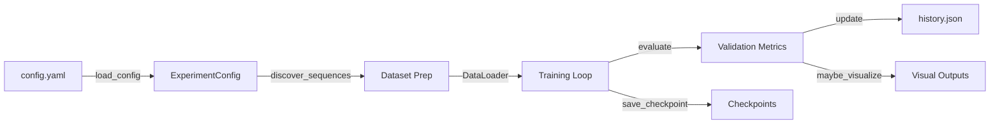

# DAVID Segmentation Trainer

## Overview
YAML-driven PyTorch pipeline for training DeepLabV3+ on DAVID-style driving footage with GPU-first optimizations. It automates dataset discovery, class balancing, mixed-precision training, and rich progress telemetry. The project assumes access to DAVID-like sequences such as the **TUM 3D Video Dataset** (CC BY 4.0, see attribution below) or equivalent internal sources.

## Features
- **Device-aware training:** Automatically selects ROCm, CUDA, or CPU backends and uses `torch.autocast` + AMP grad scaling for safe FP16 acceleration.
- **Dataset management:** Discovers paired `Images/` and `Labels/` sequences, creates reproducible splits, and raises clear errors when masks are missing.
- **Live feedback:** Presents progress bars (via `tqdm` when installed or a built-in inline bar), tracks per-class IoU, and stores checkpoints plus optional visualizations.

## Architecture Overview


## Prerequisites
- Python 3.12 (recommended)
- GPU: ROCm/CUDA device with ≥12 GB VRAM for practical training (CPU execution is supported but slow)
- Python packages:
  - `torch` + `torchvision` (matching your CUDA/ROCm stack)
  - `numpy`, `pillow`, `pyyaml`, `matplotlib`
  - `tqdm` (optional, enhances progress display)

Example environment preparation:
```powershell
python -m venv .venv
.\.venv\Scripts\activate
pip install torch torchvision --index-url <appropriate CUDA_or_ROCm_wheel>
pip install numpy pillow pyyaml matplotlib tqdm
```

## Dataset Setup
1. Clone or copy the DAVID-like dataset repository so that `Images/` and `Labels/` directories live under a shared root (e.g., `C:\Users\George\Github\3D-image-processing`).
2. Confirm that each sequence directory (`Video_XXX`) contains matching frame and mask files.
3. Update `config.yaml` `dataset.root` to reference the dataset root (relative paths are resolved from the config file directory).

## Configuration
Primary configuration file: `config.yaml`

Required keys:
- `dataset.root`
- `dataset.split.train`
- `dataset.split.val`
- `dataset.split.test`
- `training.output_dir`

Optional keys (defaults in brackets):
- `backend.target` [`auto`]
- `backend.amp` [`true`]
- `training.batch_size` [`4`]
- `training.val_batch_size` [`4`]
- `training.epochs` [`80`]
- `training.learning_rate` [`0.0001`]
- `training.weight_decay` [`0.0001`]
- `training.num_workers` [`4`]
- `training.image_size` [`[512, 512]`]
- `training.val_interval` [`1`]
- `training.visualization_interval` [`5`]
- `training.max_checkpoints` [`5`]
- `training.seed` [`1337`]
- `training.force_resplit` [`false`]

## Quick Start
1. **Activate environment & install packages** (see prerequisites).
2. **Edit `config.yaml`** to point `dataset.root` to your data and adjust training hyperparameters.
3. **Launch training:**
   ```powershell
   python train_david.py --config config.yaml
   ```
4. **Verify outputs:** watch console progress, check `outputs/david/history.json`, and review generated checkpoints/visualizations.

## Outputs & Monitoring
- Console displays device selection, class weights, and per-epoch progress with loss + GPU memory usage.
- Validation metrics (loss, mean IoU, per-class IoU) log whenever `val_interval` triggers.
- Checkpoints stored under `training.output_dir`; the best model is mirrored to `best_model.pth`.
- Optional visualization PNGs saved to `outputs/david/visualizations/epoch_XXX/` at configured intervals.

## Troubleshooting
- **`EOFError: Ran out of input` on Windows:** Set `training.num_workers` to `0` to debug, ensure dataset paths are correct, and avoid missing label directories.
- **Mismatched frame/mask counts:** The loader halts with a descriptive error. Remove incomplete `_processed` folders or supply matching masks.
- **AMP issues on CPU:** AMP is disabled automatically when no CUDA/ROCm device is detected; double-check backend settings if warnings persist.

## Roadmap
- Publish `requirements.txt` and add automated smoke tests (`run_tests_py` meta tool).
- Expand meta-layer tooling (linting, dataset validators) and document examples in `README`.

## License & Credits
- License: MIT (see `LICENSE`).
- Dataset: **TUM 3D Video Dataset** — [mediatum.ub.tum.de/1596437](https://mediatum.ub.tum.de/1596437), licensed under [Creative Commons Attribution 4.0 International (CC BY 4.0)](http://creativecommons.org/licenses/by/4.0). Cite appropriately when using the dataset.
- Pipeline inspiration: DAVID dataset authors and PyTorch & TorchVision teams; tqdm for progress visualization.

## Contributing & Support
Issues and pull requests are welcome. Open a GitHub issue with reproduction details or submit PRs following conventional commits and include notes on dataset availability.

## Call To Action
Configure `config.yaml`, run a training session, and share qualitative/quantitative results via the issue tracker to help evolve the pipeline.
