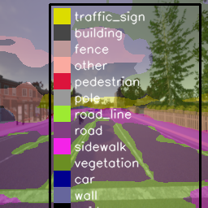
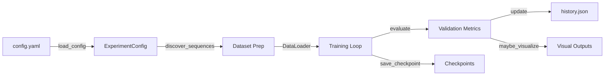
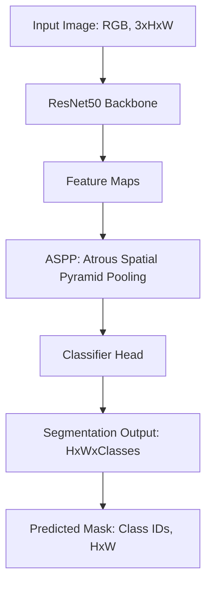
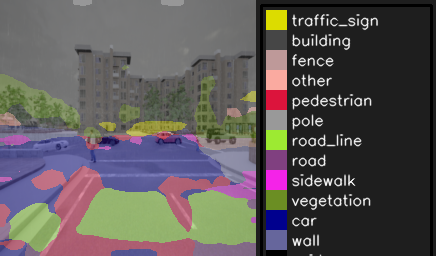

# Table of Contents
- [Example Output](#example-segmentation-output)
- [Context Update](#context-update-2025-12-07)
- [README Update](#readme-update-2025-12-07)
- [DAVID Segmentation Trainer](#david-segmentation-trainer)
  - [Overview](#overview)
  - [Features](#features)
  - [Architecture Overview](#architecture-overview)
  - [Model Architecture & Data Flow](#model-architecture--data-flow)
  - [Model Architecture Diagram](#model-architecture-diagram)
  - [Prerequisites](#prerequisites)
  - [Dataset Setup](#dataset-setup)
  - [Configuration](#configuration)
  - [Quick Start](#quick-start)
  - [Diagnostics](#diagnostics)
  - [Outputs & Monitoring](#outputs--monitoring)
  - [Troubleshooting](#troubleshooting)
  - [Roadmap](#roadmap)
  - [License & Credits](#license--credits)
  - [Contributing & Support](#contributing--support)
  - [Call To Action](#call-to-action)



# ---
# Context Update (2025-12-07)

## System Status
- Python segmentation pipeline for DAVID-style datasets; meta-kernel operational.
- Dataset config now targets a sibling dataset repo (e.g., `../dataset-repo`) with `Images/` & `Labels/` dirs.
- Training loop emits live progress (tqdm or inline), reports GPU memory.
- README covers setup, architecture, troubleshooting.
- Next: generate `requirements.txt`, implement `run_tests_py` tool (pytest wrapper).

## Tool Registry
*Project structure and test tools are available for internal use.*

## Architecture
Root: `train_david.py`, `config.yaml`, `LICENSE`, `testing.ipynb`, `.gitignore`.
Docs: `README.md` (quick start, config, dataset, roadmap).
Package: `model_backend/` (config, data, engine, metrics, model, pipeline, visualization, __init__).
VCS: `.git/` tree.

# ---


# DAVID Segmentation Trainer

## Overview
YAML-driven PyTorch pipeline for training DeepLabV3+ on DAVID-style driving footage with GPU-first optimizations. It automates dataset discovery, class balancing, mixed-precision training, and rich progress telemetry. The project assumes access to DAVID-like sequences such as the **TUM 3D Video Dataset** (CC BY 4.0, see attribution below) or equivalent internal sources.

## Features
- **Device-aware training:** Automatically selects ROCm, CUDA, or CPU backends and uses `torch.autocast` + AMP grad scaling for safe FP16 acceleration.
- **Dataset management:** Discovers paired `Images/` and `Labels/` sequences, creates reproducible splits, and raises clear errors when masks are missing.
- **Live feedback:** Presents progress bars (via `tqdm` when installed or a built-in inline bar), tracks per-class IoU, and stores checkpoints plus optional visualizations.

## Architecture Overview


## Model Architecture & Data Flow

**Model:** DeepLabV3+ with ResNet50 backbone (PyTorch/TorchVision)
- **Input:** RGB image, shape `[3, H, W]` (default `[3, 256, 256]` or `[3, 512, 512]`)
- **Output:** Segmentation mask, shape `[H, W]`, each pixel is an integer class ID (0–12)
- **Classes:** 13 semantic classes (traffic_sign, building, fence, other, pedestrian, pole, road_line, road, sidewalk, vegetation, car, wall, void)

**Training Data:**
- Images: `Images/Video_XXX/*.png` (or .jpg)
- Masks: `Labels/Video_XXX/*.png` (RGB, same filenames as images)

**Batch Processing:**
- Each batch: `(images, masks, paths)`
  - `images`: Tensor `[batch_size, 3, H, W]`
  - `masks`: Tensor `[batch_size, H, W]` (class IDs)
  - `paths`: List of image file paths

**Inference:**
- Model predicts a mask for each input image.
- Visualizations overlay predicted masks on input images for qualitative review.

**Example Data Flow:**
1. Load image and mask, resize to `image_size`.
2. Normalize image, encode mask to class IDs.
3. Forward pass: `output = model(image_tensor)['out']` → `[batch_size, num_classes, H, W]`
4. Predicted mask: `output.argmax(1)` → `[batch_size, H, W]`
5. Overlay prediction for visualization.

---

## Model Architecture Diagram



---

## Prerequisites
- Python 3.12 (recommended)
- GPU: ROCm/CUDA device with ≥12 GB VRAM for practical training (CPU execution is supported but slow)
- Python packages:
  - `torch` + `torchvision` (matching your CUDA/ROCm stack)
  - `numpy`, `pillow`, `pyyaml`, `matplotlib`
  - `tqdm` (optional, enhances progress display)

Example environment preparation:
```powershell
python -m venv .venv
.\.venv\Scripts\activate
pip install torch torchvision --index-url <appropriate CUDA_or_ROCm_wheel>
pip install numpy pillow pyyaml matplotlib tqdm
```

## Dataset Setup
1. Clone or copy the DAVID-like dataset repository so that `Images/` and `Labels/` directories live under a shared root (e.g., `../dataset-repo`).
2. Confirm that each sequence directory (`Video_XXX`) contains matching frame and mask files.
3. Update `config.yaml` `dataset.root` to reference the dataset root (relative paths are resolved from the config file directory).

## Configuration
Primary configuration file: `config.yaml`


Required keys:
- `dataset.root`
- `training.output_dir`

Optional for checkpointing/resume:
- `training.resume_from_checkpoint`: Path to a previous checkpoint to resume training (e.g., `outputs/model/best_model.pth`). Set to `null` to start fresh.

Optional keys (defaults in brackets):
- `dataset.include` — restrict training to specific sequence(s), e.g. `["Video_000"]` for single-sequence runs
- `dataset.labels` — explicitly specify labels directory if not `Labels/`
- `backend.target` [`auto`]
- `backend.amp` [`true`]
- `training.batch_size` [`4`]
- `training.val_batch_size` [`4`]
- `training.epochs` [`80`]
- `training.learning_rate` [`0.0001`]
- `training.weight_decay` [`0.0001`]
- `training.num_workers` [`4`]
- `training.image_size` [`[512, 512]`]
- `training.val_interval` [`1`]
- `training.visualization_interval` [`5`]
- `training.max_checkpoints` [`5`]
- `training.seed` [`1337`]
- `training.force_resplit` [`false`]

If only a training sequence is provided (no validation/test), validation and visualization steps are skipped automatically.

## Quick Start
1. **Activate environment & install packages** (see prerequisites).
2. **Edit `config.yaml`** to point `dataset.root` to your data and adjust training hyperparameters. To train on a single sequence, add:
  ```yaml
  dataset:
    root: ../dataset-repo
    include: ["Video_000"]
  ```
3. **Launch training:**
  ```powershell
  python .\scripts\run_training.py --config .\config.yaml
  ```
  ## Diagnostics

  Collect per-process GPU memory and reconcile with PyTorch allocator stats.

  - Enable PowerShell script execution for the current session only:
    ```powershell
    Set-ExecutionPolicy -Scope Process -ExecutionPolicy Bypass
    Unblock-File .\scripts\gpu_proc_sampler.ps1
    ```

  - Start the GPU sampler (Admin recommended) and run training in a separate terminal:
    ```powershell
    # Terminal A (Admin recommended)
    Push-Location "c:\Users\George\Github\ImageML\scripts"
    .\gpu_proc_sampler.ps1 -Duration 60 -OutFile ..\gpu_proc_usage.csv -Interval 1

    # Terminal B
    Push-Location "c:\Users\George\Github\ImageML"
    python .\scripts\run_training.py --config .\config.yaml
    ```

  - Check `gpu_proc_usage.csv` for the top `GPU_MB` usage and correlate with `memory_diagnostics.log` entries like:
    - `VRAM: X MB (alloc), Y MB (reserved), Z MB free / T MB total`

  This helps identify cases where the driver or other processes hold most VRAM while PyTorch allocator usage remains low.

  To resume from a previous checkpoint, set `training.resume_from_checkpoint` in your config file to the checkpoint path.
4. **Verify outputs:** watch console progress, check `outputs/model/history.json`, and review generated checkpoints/visualizations.

## Outputs & Monitoring
- Console displays device selection, class weights, and per-epoch progress with loss + GPU memory usage.
- Validation metrics (loss, mean IoU, per-class IoU) log whenever `val_interval` triggers.
- Checkpoints stored under `training.output_dir`; the best model is mirrored to `best_model.pth`.
- Optional visualization PNGs saved to `outputs/model/visualizations/epoch_XXX/` at configured intervals.

## Troubleshooting
- **`EOFError: Ran out of input` on Windows:** Set `training.num_workers` to `0` to debug, ensure dataset paths are correct, and avoid missing label directories.
- **Mismatched frame/mask counts:** The loader halts with a descriptive error. Remove incomplete `_processed` folders or supply matching masks.
- **AMP issues on CPU:** AMP is disabled automatically when no CUDA/ROCm device is detected; double-check backend settings if warnings persist.

## Roadmap
- Publish `requirements.txt` and add automated smoke tests (`run_tests_py` meta tool).
- Expand meta-layer tooling (linting, dataset validators) and document examples in `README`.

## License & Credits
- License: MIT (see `LICENSE`).
- Dataset: **TUM 3D Video Dataset** — [mediatum.ub.tum.de/1596437](https://mediatum.ub.tum.de/1596437), licensed under [Creative Commons Attribution 4.0 International (CC BY 4.0)](http://creativecommons.org/licenses/by/4.0). Cite appropriately when using the dataset.
- Pipeline inspiration: DAVID dataset authors and PyTorch & TorchVision teams; tqdm for progress visualization.

## Contributing & Support
Issues and pull requests are welcome. Open a GitHub issue with reproduction details or submit PRs following conventional commits and include notes on dataset availability.

## Call To Action
Configure `config.yaml`, run a training session, and share qualitative/quantitative results via the issue tracker to help evolve the pipeline.

---

> **Note:** Example paths in this README use placeholder directories. Replace any user-specific paths (e.g., `C:/Users/YourName/...`) with your own dataset locations. No private or sensitive information is required for setup or usage.

## Customizing the Model (Backbone, Layers, Activation)

You can adjust the model architecture and hyperparameters by editing `model_backend/model.py` and (optionally) exposing new options in `config.yaml`.

### Example: Change Backbone or Activation

1. **Change Backbone (e.g., ResNet50 → ResNet101):**
  - Open `model_backend/model.py`.
   - Find the model creation code (e.g., `torchvision.models.segmentation.deeplabv3_resnet50`).
   - Replace with another backbone, e.g., `deeplabv3_resnet101`.

2. **Change Activation Function:**
   - In `model.py`, locate where activations are used (e.g., `nn.ReLU`).
   - Replace with your preferred activation (e.g., `nn.LeakyReLU`).

3. **Expose Options in config.yaml (Optional):**
   - Add keys like `model.backbone` or `model.activation` to your `config.yaml`:
     ```yaml
     model:
       backbone: resnet101
       activation: leaky_relu
     ```
   - Update `model.py` to read these values and construct the model accordingly.

### Making It Configurable
- To make these options user-configurable, add them to your config and update the code to use them.
- For more advanced changes (e.g., different architectures), you may need to extend the model-building logic in `model.py`.

**Tip:** After making changes, always test training and inference to ensure compatibility.

---

## Using a Custom Model Architecture

To use a more recent or custom model architecture (e.g., transformer-based, UNet, or your own design):

1. **Implement Your Model:**
  - Create your model class in `model_backend/model.py` or a new file (e.g., `model_backend/custom_models.py`).
   - Ensure it inherits from `torch.nn.Module` and implements a `forward` method.
   - Example:
     ```python
     import torch.nn as nn
     class MyCustomModel(nn.Module):
         def __init__(self, num_classes):
             super().__init__()
             # Define layers here
         def forward(self, x):
             # Forward pass logic
             return {"out": ...}  # Match DeepLabV3+ output format
     ```

2. **Update Model Builder:**
  - In `model_backend/model.py`, update the `build_model` function to select your custom model based on a config key (e.g., `model.type: custom`).
   - Example:
     ```python
     def build_model(num_classes, model_type="deeplabv3+", ...):
         if model_type == "custom":
             return MyCustomModel(num_classes)
         # ...existing options...
     ```

3. **Configure in config.yaml:**
   - Add or update the model section:
     ```yaml
     model:
       type: custom
       # Add any custom model parameters here
     ```

4. **(Optional) Add Custom Parameters:**
   - Pass additional config values to your model as needed (e.g., depth, heads, etc.).

5. **Test Training and Inference:**
   - Run training and inference to ensure your model integrates smoothly.

**Tip:** Follow the input/output conventions of the existing pipeline for compatibility (input: `[B, 3, H, W]`, output: `{"out": logits}`).

---

## Example Outputs: Good vs. Bad Models

<b>Good Model Output</b><br>

<br>
<b>Bad Model Output</b><br>


- **Top:** Output from a trained model on training set (clear class separation, accurate segmentation).
- **Bottom:** Output trained trained model on a validation dataset (incorrect, or missing segmentation).

> Replace these images with your own results as you improve your models!

---
